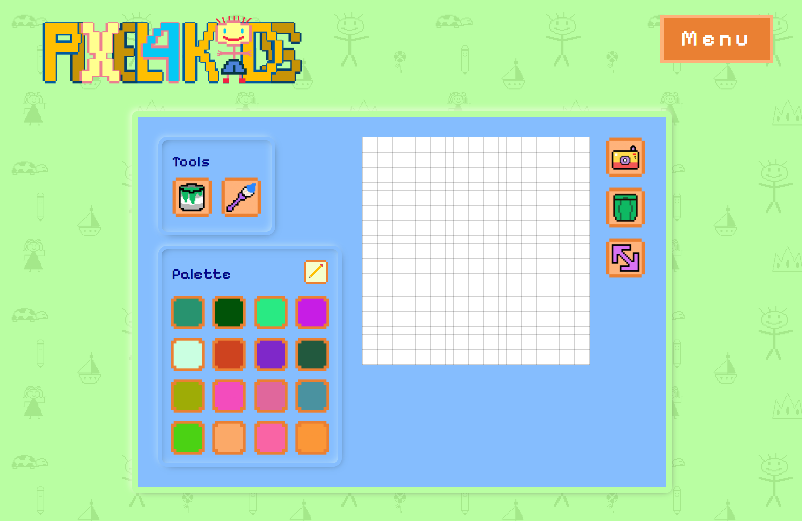

# PIXEL 4 KIDS

## Table of contents

- [Overview](#overview)
  - [Links](#links)
- [My process](#my-process)
  - [Built with](#built-with)
  - [Difficulties](#Difficulties)
  - [Useful resources](#useful-resources)
- [Author](#author)
- [Acknowledgments](#acknowledgments)

## Overview

### Links

- Live Site URL: [PIXEL 4 KIDS website](https://pixel4kids.netlify.app/)

## My process

### Built with

- Semantic HTML5 markup
- Accesibility 
- CSS:
  - Grid
  - Flexbox
  - Custom variables
  - Media Queries
- SASS:
  - Partials
  - Mixins
  - Sass variables
- Javascript

### Difficulties

As I wanted to make a bilingual page that was also accessible, the logic of translating both the content and the aria-labels, or alt tags, was definitely a challenge. Also, the javascript needed to make the bucket and the brush functional might not seem complicated, but it was a difficult and rewarding obstacle to beat.

### Useful resources

- [MDN Web Docs](https://developer.mozilla.org/en-US/)
- [SASS](https://sass-lang.com/documentation/at-rules/control/if/)
- [CSS Tricks](https://css-tricks.com/)
- Youtube Channels:
  - [Kevin Powell](https://www.youtube.com/@KevinPowell)
  - [WebDevSimplified](https://www.youtube.com/@WebDevSimplified)
  - [Midulive](https://www.youtube.com/@midulive)
- [Chat GPT](https://chat.openai.com/)

## Author

- Linkedin - [Gabriela Plasencia](https://www.linkedin.com/in/gabyplasencia/)

## Acknowledgments

- Music: [KevinMacLeod - Itty Bitty 8 Bit](https://www.youtube.com/watch?v=DzFXGsRvSwA)
- The design was made by me [Figma design](https://www.figma.com/file/RkZx3WMw3iyOlvFdhYX0FB/pixel-for-kids?type=design&node-id=0%3A1&mode=design&t=ZICnj1NQoTYALs4W-1)